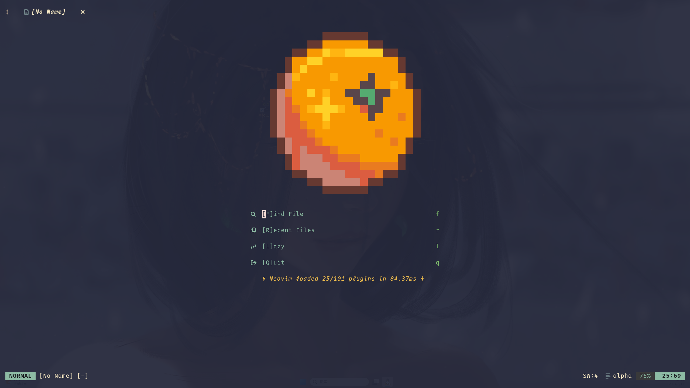

# Neovim Configuration

## Overview

Personal Neovim setup focused on Python and Rust. C/C++ (with CMake) is
supported but secondary. Used for coding, notes, and general editing.

Recommended terminal: [Kitty](https://github.com/kovidgoyal/kitty)

## Preview



## Highlights

- Modular Lua config with clear plugin groups.
- LSP + diagnostics + inlay hints with per-filetype enablement.
- Treesitter + textobjects and UI polish.
- Git workflow: gitsigns, diffview, neogit, and helpers.
- Fuzzy finding + file navigation (Snacks picker, neo-tree).
- Formatting, linting, DAP, and task runner integrations.
- Optional AI tools (sidekick).

## Requirements

Required:
- Neovim 0.10+ (for current APIs/inlay hints).
- Git (plugin bootstrap).

Recommended:
- A Nerd Font (icons/glyphs).
- ripgrep (live grep).
- fzf (optional, used by some UI integrations when available).
- fd (used by Snacks picker).

Optional (install as needed):
- LSP servers via Mason (`:Mason`).
- Formatters/linters: ruff, cmakelint, cmake-format, stylua, clang-format, rustfmt.
- Debuggers/adapters: gdb, codelldb, OpenDebugAD7.
- lazygit (terminal git UI).

## Quick Start

1. Install Neovim and Git.
2. Clone this repo into `$XDG_CONFIG_HOME/nvim` (usually `~/.config/nvim`).
3. Start `nvim` to auto-install plugins.
4. Run `:checkhealth` if you want to validate the setup.

## Usage Notes

- Leader key: `<Space>`
- Local leader: `,`
- Plugin manager: `:Lazy`
- LSP tooling: `:Mason`

## Docs

- Modules and layout: `doc/modules.md`
- Language support: `doc/languages.md`
- Q&A and implementation notes: `doc/faq.md`
- Toast API notes: `doc/abel-toast.md`

## Structure

High-level layout of the repo:

- Tree view:
```
nvim/
├─ init.lua
├─ luarc.json
├─ lazy-lock.json
├─ README.md
├─ lua/abel/
│  ├─ init.lua
│  ├─ config/
│  │  ├─ autocmds.lua
│  │  ├─ capabilities.lua
│  │  ├─ custom.lua
│  │  ├─ dap.lua
│  │  ├─ gui.lua
│  │  ├─ keymaps.lua
│  │  ├─ lang.lua
│  │  ├─ lazy-plugins.lua
│  │  ├─ locals.lua
│  │  ├─ lsp.lua
│  │  ├─ misc.lua
│  │  ├─ options.lua
│  │  └─ overseer/
│  │     ├─ run_script.lua
│  │     └─ cpp/
│  │        └─ cpp_build.lua
│  ├─ plugins/
│  │  ├─ init.lua
│  │  ├─ colorscheme/
│  │  ├─ dap/
│  │  ├─ editor/
│  │  ├─ efficiency/
│  │  ├─ filetype/
│  │  ├─ git/
│  │  ├─ lib/
│  │  ├─ lsp/
│  │  ├─ mini/
│  │  ├─ snacks/
│  │  ├─ tool/
│  │  ├─ treesitter/
│  │  └─ ui/
│  └─ util/
│     ├─ base/
│     ├─ core/
│     ├─ editor/
│     ├─ lsp/
│     ├─ plugin/
│     ├─ tool/
│     └─ ui/
├─ after/
│  └─ ftplugin/
├─ lsp/
├─ doc/
├─ scripts/
└─ extend-snippets/
```

- `init.lua`: entry point.
- `lua/abel/config/`: core settings (options, keymaps, LSP, UI, etc).
- `lua/abel/plugins/`: plugin specs grouped by area.
- `after/`: filetype and after-load tweaks.
- `lsp/`: per-server LSP configs.
- `doc/`: docs and assets (screenshots).
- `scripts/`: helper scripts.
- `extend-snippets/`: custom snippets.

## Updating

- `:Lazy sync` to update plugins.
- `:Mason` to update LSP servers/tools.
